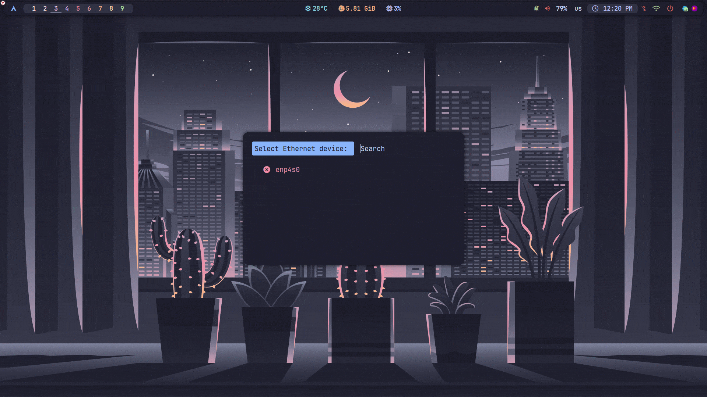
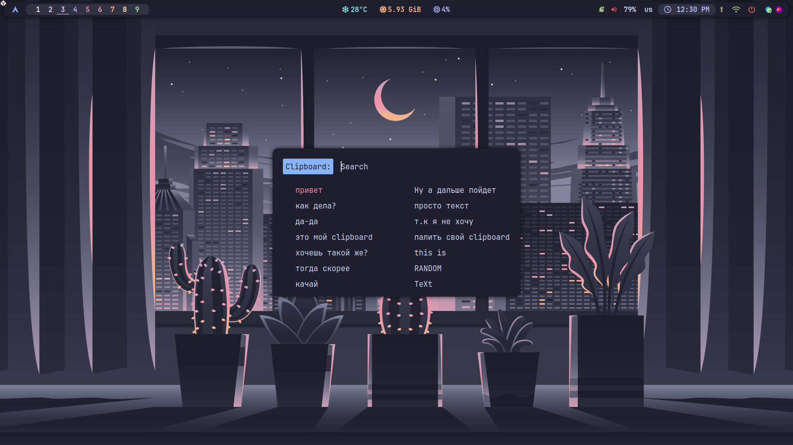

<div align="center">
  <h2>🛠 Rofi-Sys-Tools</h2>
</div>

Enhance your workflow with **Rofi-Sys-Tools** - a comprehensive set
of utilities for managing **Wi-Fi**, **Ethernet** and **clipboard** directly from **rofi**.
An ideal tool for **Linux** enthusiasts seeking maximum
efficiency and organization of their system resources.


<div align="center">
<h2>🛜 Wifi Menu</h2>


</div>

<div align="center">
<h2>🔌 Ethernet Menu</h2>



</div>

<div align="center">
<h2>📋 Clipboard Manager</h2>



</div>


<div align="center">
  <h2>👨‍💻 Installation</h2>
</div>

1. Cloning the repository: `git clone https://github.com/DIMFLIX-OFFICIAL/rofi-sys-tools.git ~/bin/rofi-sys-tools`
2. Go to the catalog: `cd ~/bin/rofi-sys-tools`
3. Launching utilities: \
   `sh rofi-wifi-menu.sh` \
   `sh rofi-ethernet-menu.sh` \
   `sh rofi-clipboard-manager.sh`
   
4. (Optional) For easy access, add the script somewhere in your $PATH.


<div align="center">
  <h2>⚙️ Polybar Configuration</h2>
</div>

```
[module/wlan]
type = internal/network
interface = wlan0
interval = 3.0
format-connected =  <label-connected>
label-connected = "%{A1:sh ~/bin/rofi-sys-tools/rofi-wifi-menu.sh:} %{A}"
label-connected-foreground = #A3BE8C 
format-disconnected = <label-disconnected>
label-disconnected = "%{A1:sh ~/bin/rofi-sys-tools/rofi-wifi-menu.sh:}󰖪 %{A}"
label-disconnected-foreground = #D35F5E

[module/ethernet]
type = custom/script
exec = "sh ~/bin/rofi-sys-tools/rofi-ethernet-menu.sh status"
interval = 3.0
click-left = "sh ~/bin/rofi-sys-tools/rofi-ethernet-menu.sh"
label = "%output%"
```

<div align="center">
  <h2>📜 License</h2>
</div>

This project is released under the **MIT license**, which grants the following permissions:

- Commercial use
- Distribution
- Modification
- Private use

For more convoluted language, see the [**MIT License**](LICENSE)
