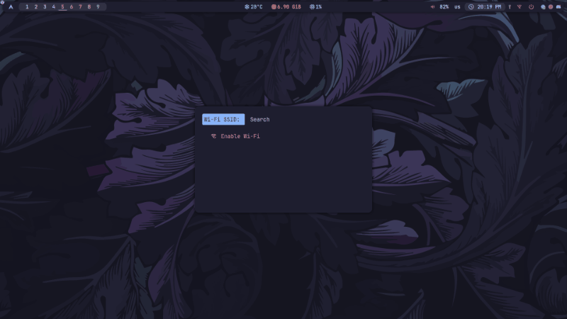

<div align="center">
  <h1>Rofi Wifi Menu</h3>

  
  
  `linux` `rofi` `nmcli`
</div>


# Installation
1. `git clone https://github.com/DIMFLIX-OFFICIAL/rofi-wifi-menu.git`
2. `cd rofi-wifi-menu`
3. `sh rofi-wifi-menu.sh`
   
(Optional) For easy access, add the script somewhere in your $PATH.

# Polybar Configuration
```
[module/wlan]
type = internal/network
interface = wlan0
interval = 3.0
format-connected =  <label-connected>
label-connected = "%{A1:sh <PATH-TO-SCRIPT>:} %{A}"
label-connected-foreground = #A3BE8C 
format-disconnected = <label-disconnected>
label-disconnected = "%{A1:sh <PATH-TO-SCRIPT>:}󰖪 %{A}"
label-disconnected-foreground = #D35F5E
```

Replace <PATH-TO-SCRIPT> with the path to the rofi-wifi -menu executable file
